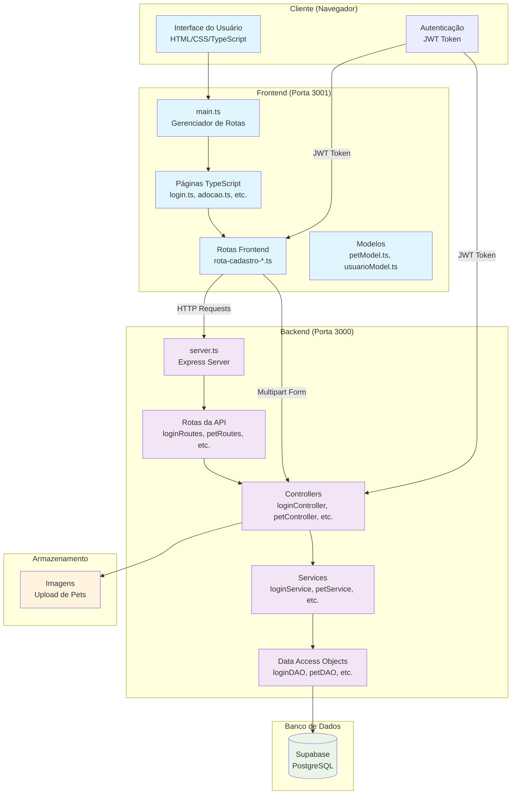
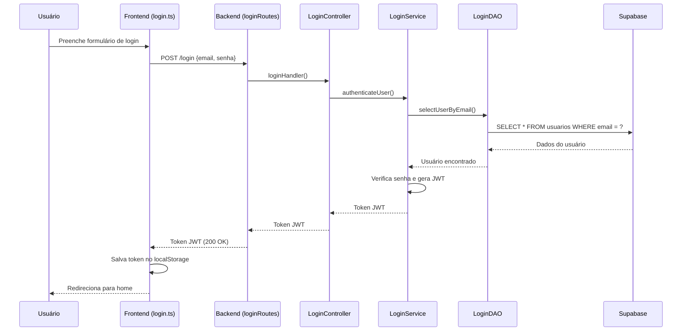
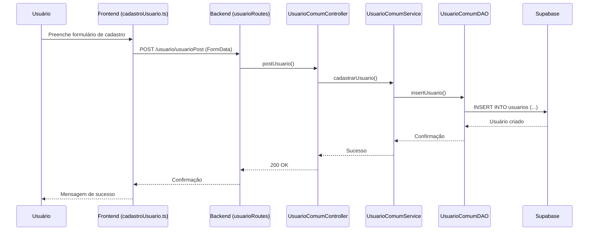
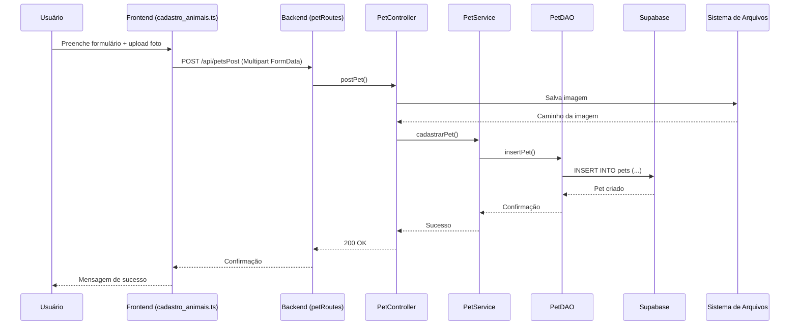
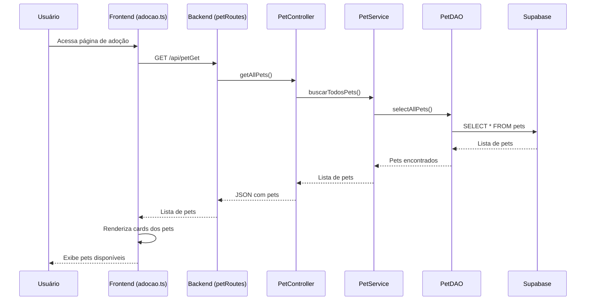
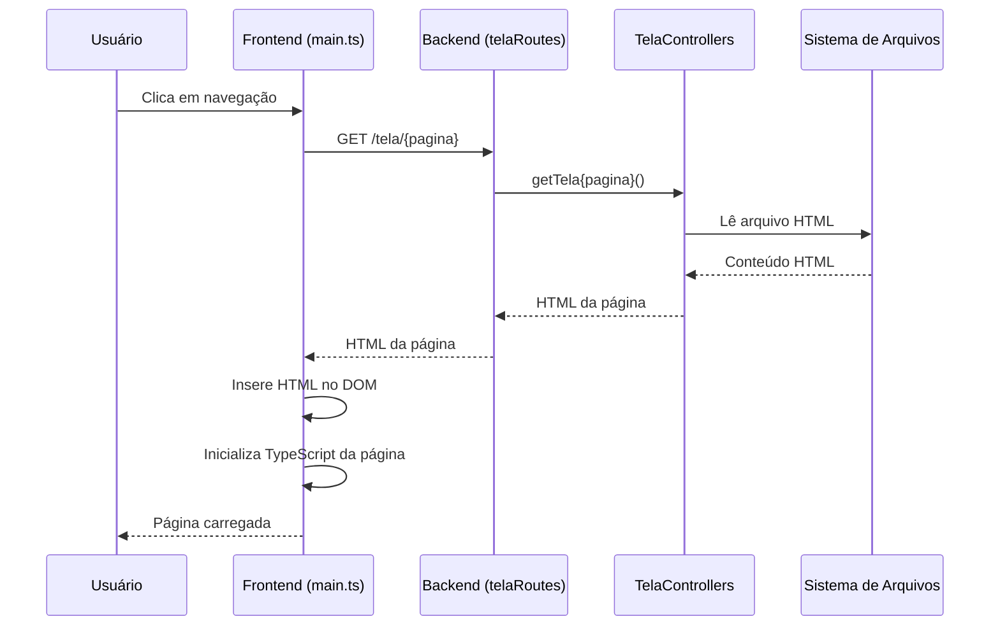
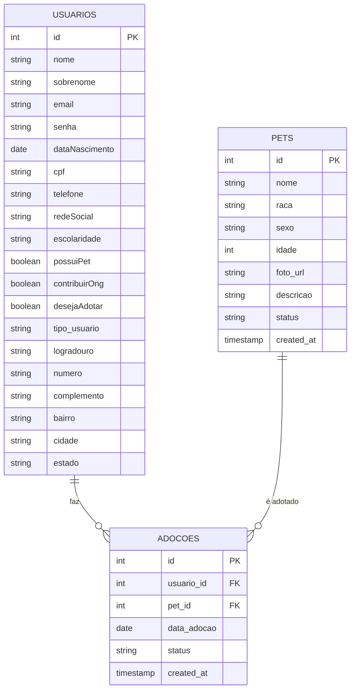

# Diagrama de Comunicação - ONG Recanto dos Animais

## Visão Geral da Arquitetura

## Fluxo de Comunicação Detalhado

### 1. Autenticação (Login)

### 2. Cadastro de Usuário

### 3. Cadastro de Pet

### 4. Listagem de Pets (Adoção)

### 5. Carregamento de Páginas (Tela Routes)

## Estrutura de Dados

### Modelos Principais

## Tecnologias Utilizadas

### Frontend
- **HTML/CSS**: Interface do usuário
- **TypeScript**: Lógica de aplicação
- **Bootstrap**: Framework CSS
- **Fetch API**: Comunicação HTTP

### Backend
- **Node.js**: Runtime JavaScript
- **Express.js**: Framework web
- **TypeScript**: Linguagem de programação
- **Multer**: Upload de arquivos
- **JWT**: Autenticação

### Banco de Dados
- **Supabase**: Plataforma PostgreSQL
- **PostgreSQL**: Banco de dados relacional

### Infraestrutura
- **Docker**: Containerização
- **VPS**: Hospedagem
- **CORS**: Cross-origin resource sharing

## Pontos de Comunicação

### Endpoints da API

| Método | Endpoint | Descrição |
|--------|----------|-----------|
| POST | `/login` | Autenticação de usuário |
| POST | `/usuario/usuarioPost` | Cadastro de usuário comum |
| POST | `/api/petsPost` | Cadastro de pet |
| GET | `/api/petGet` | Listagem de pets |
| GET | `/tela/home` | Página inicial |
| GET | `/tela/adocao` | Página de adoção |
| GET | `/tela/login` | Página de login |
| GET | `/tela/cadastroUsuario` | Página de cadastro |
| GET | `/tela/cadastrarAnimais` | Página de cadastro de pets |

### Fluxo de Dados

1. **Frontend → Backend**: Requisições HTTP (GET, POST)
2. **Backend → Database**: Queries SQL via Supabase
3. **Backend → Storage**: Upload de imagens
4. **Backend → Frontend**: Respostas JSON/HTML
5. **Frontend → Frontend**: Manipulação do DOM e estado local

### Segurança

- **CORS**: Configurado para permitir apenas `localhost:3001`
- **JWT**: Tokens de autenticação com expiração de 1h
- **Validação**: Dados validados no backend antes de persistir
- **Upload**: Imagens processadas e validadas antes do armazenamento 